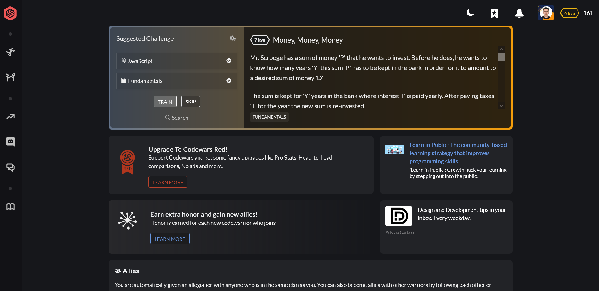
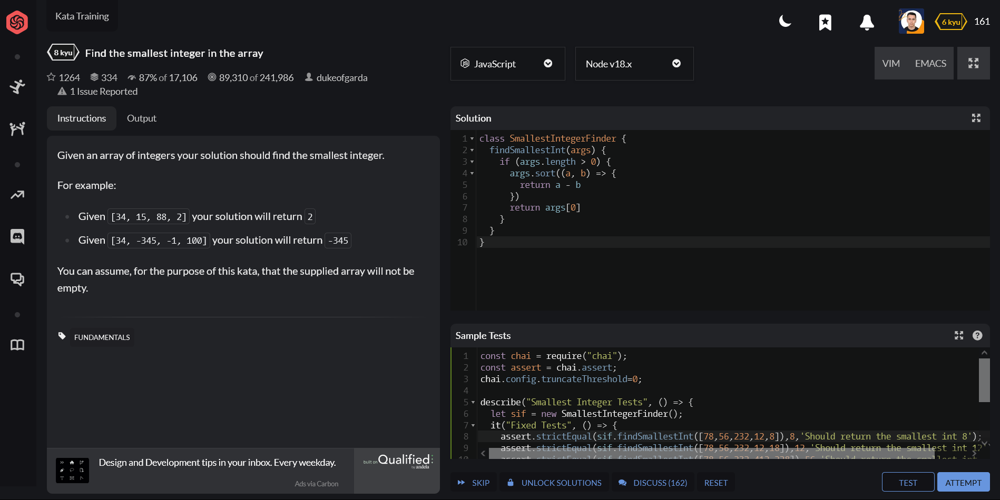

# Desafíos de Codewars en JavaScript Vanilla 🚀

¡Bienvenido a mi repositorio de desafíos de Codewars en JavaScript! Aquí encontrarás una colección de los últimos desafíos que he resuelto en la plataforma Codewars utilizando JavaScript Vanilla. Mi objetivo es mantenerme en una mejora continua y perfeccionar mis habilidades de programación resolviendo estos desafíos de forma regular.

## ¿Qué es Codewars? 🤔

Codewars es una plataforma en línea que ofrece una amplia variedad de desafíos de programación en varios lenguajes de programación. Los desafíos están diseñados para mejorar tus habilidades de codificación y resolver problemas mediante la práctica y la resolución de desafíos de programación.

### Capturas de Pantalla 🖼️

Aquí hay un vistazo a cómo se ve Codewars:

#### Vista General

#### Resolviendo Desafío

## Motivación 💪

Mi motivación principal al participar en Codewars es mejorar mis habilidades de resolución de problemas, aprender nuevos conceptos y técnicas de programación, y mantenerme desafiado continuamente. Creo firmemente en la importancia de la práctica constante y la resolución de problemas para convertirse en un mejor desarrollador de software.

## Estructura del Repositorio 📁

En este repositorio, encontrarás una carpeta específica para JavaScript donde se almacenan todos los desafíos resueltos utilizando Vanilla JavaScript. Dentro de esta carpeta, los desafíos están organizados por nivel de dificultad, desde los más fáciles hasta los más difíciles.

## Contribuciones y Retroalimentación 🤝

¡Siéntete libre de explorar los desafíos, revisar mi código y proporcionar retroalimentación constructiva! También estoy abierto a colaboraciones en la resolución de desafíos o en la mejora de las soluciones existentes.

## ¡Únete! 👨‍💻

Si te apasiona la programación y la resolución de problemas en JavaScript, te invito a unirte a mí en Codewars. Juntos podemos desafiarnos mutuamente, aprender y crecer como desarrolladores de software.

[¡Visita mi perfil en Codewars!](https://www.codewars.com/users/dieherram)

¡Gracias por visitar mi repositorio y compartir mi pasión por la programación y la mejora continua con JavaScript Vanilla!

Happy coding! 💻✨